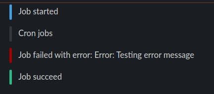

# Slack bot logger

## Getting started

At first, you need to create a new Slack application. Your bot should have `chat:write` permission and access to `Incoming Webhooks`.

After that you should authorize your bot in one of your chat rooms and add a new webhook URL. Use this URL in the logger.

## How to use the logger

```js
// Import logger class
const Logger = require('slack-bot-logger')

// Create an instance of the class and pass webhook URL as an argument
const logger = new Logger('<SLACK_WEBHOOK_URL>')

// Log default message
logger.log('Cron jobs')

// Log info message
logger.info('Job started')

// Log success message
logger.success('Job succeed')

// Log error message
logger.error(`Job failed with error: ${error.toString()}`)
```

Example output in Slack:

